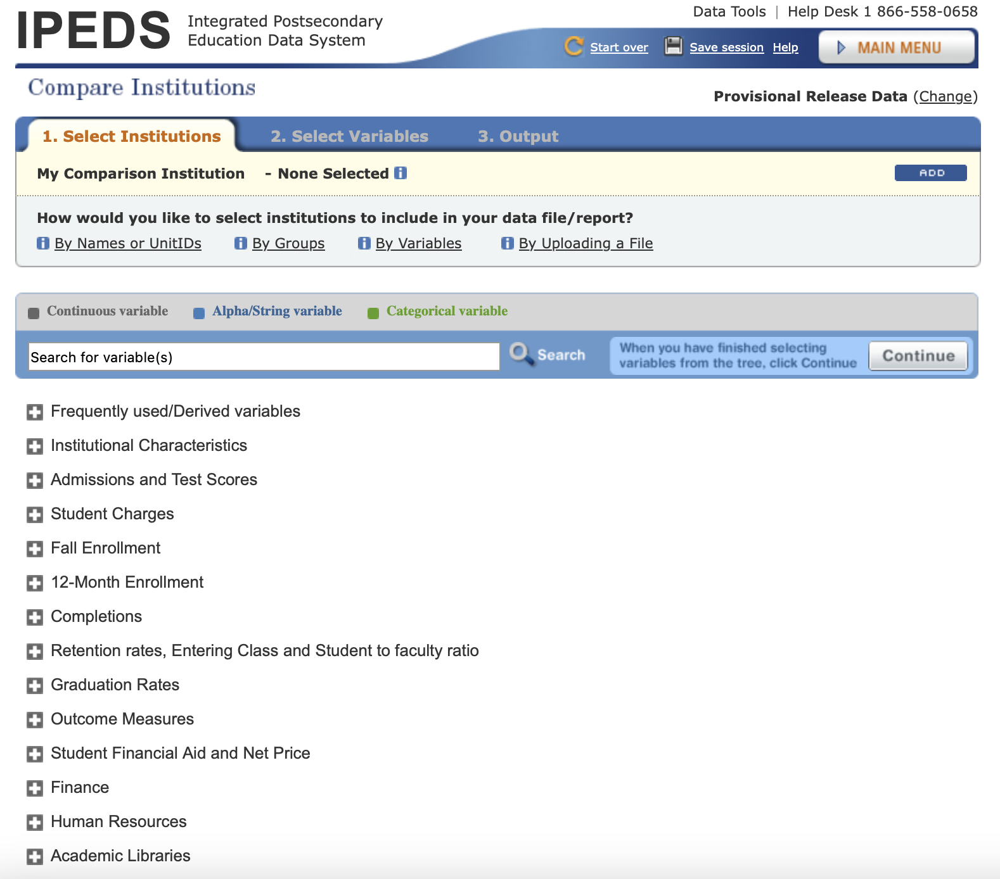
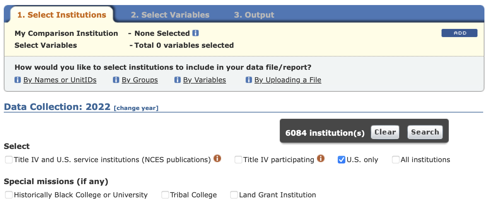
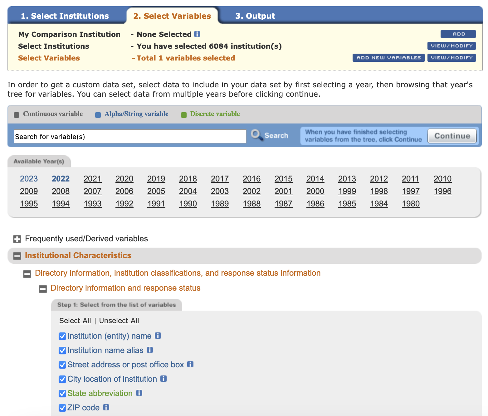
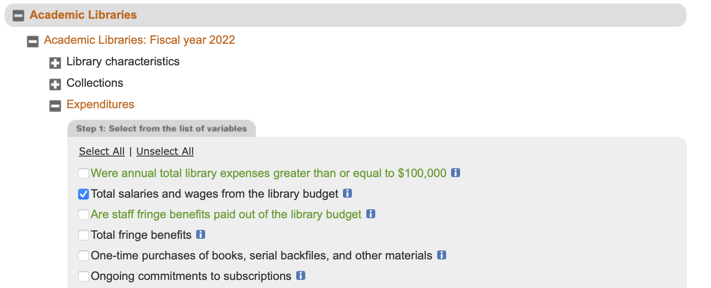
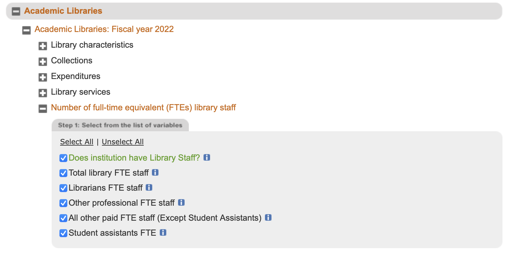
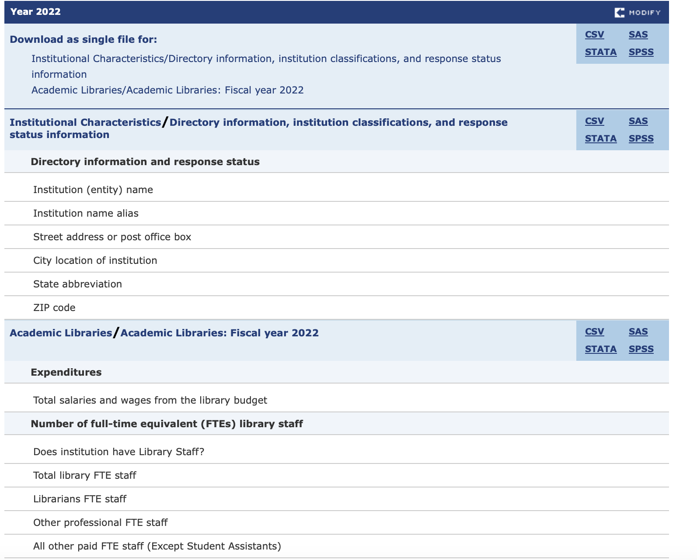
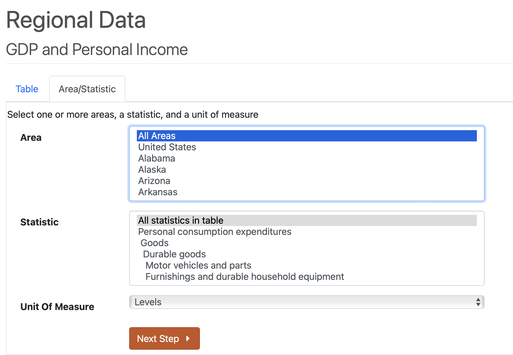
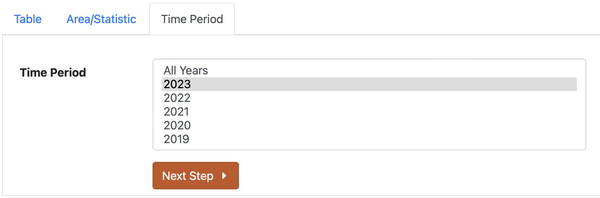

# Title
Where to Shelf Your Career: Comparing Academic Library Staffing and Costs of Living

# Link to archival record
CodeOcean

# Contributors
- Wanheng Li: 0009-0002-4039-6567

# Summary
As an LIS student interested in working in an academic library, I want to find out which institutions hire the most librarians and which states offer the best income-to-cost-of-living ratio for librarians. This project aims to serve as a reference for fellow library science students pursuing academic library careers. It examines the staffing levels of academic institutions and states, evaluates average library staff salaries in each state, and compares these earnings to regional living costs.<br>

Four tables are created:
- A ranked list of the top 50 universities offering the highest number of library positions
- A ranked list of the top 50 universities offering the highest average salaries for library positions
- A ranked summary of the number of library positions offered in each state
- A ranked summary of the average salary for library positions in each state

Two visualizations are created:
- The first visualization is an interactive map linked to a bar chart, illustrating the 2023 Personal Consumption Expenditures (PCE) by state. Each state is color-coded according to its overall expenditures. The accompanying bar chart provides a more detailed breakdown of these costs into specific categories like housing and food. By clicking on a state in the map, the bar chart updates to reflect that state’s data. This allows users to quickly identify which states have higher living expenses and understand how various expenditure categories contribute to the overall cost of living.

- The second visualization is a scatter plot comparing average library staff salaries to each state’s living costs. Hovering over the data points reveals the state names. This plot helps users quickly identify states offering higher average salaries combined with lower living expenses.

# Data profile 
- `AcademicLibrary.csv` contains institutional information (including UnitID, name, address) and academic libraries information (including staffing and expenditures). The variables used in this project are university name, state, number of librarians and library staff, salary expenditure. IPEDS data is is generally available for public use without any specific license restrictions.
- `table.xlsx` summarizes personal consumption expenditures in the United States for 2023, with key columns including: GeoFips, a geographic identifier; GeoName, the corresponding region name; LineCode, numerical codes representing expenditure categories; Description, textual descriptions of categories; and 2023, expenditure values in millions of dollars. Data from BEA is also generally available for public use without any specific license restrictions.
- `us-state-names.tsv` downloable from https://raw.githubusercontent.com/GovLab/opencorporatesd3/refs/heads/master/us-state-names.tsv. This dataset likely falls within the public domain, as it contains only U.S. state names and their corresponding codes, which are factual and not copyrightable.

# Findings
- Although California, Texas, Florida, and New York offer a large number of library staff positions, their high cost of living compared to salaries may reduce their overall appeal.
- Delaware presents an excellent cost-of-living-to-salary ratio, but currently offers relatively few library positions.
- Users can utilize these visualizations to explore states of interest and determine the best balance between available library positions, cost of living, and salary levels that align with their personal requirements.

# Future work
The initial analysis estimated average librarian salaries by dividing the total salary budget by the total number of library staff. However, universities have librarians and other full-time library staff, and it is likely that they have different salary levels. To obtain a more accurate estimate of average librarian salaries, future research could explore alternative data sources,

While Personal Consumption Expenditures (PCE) offer a broad overview of spending patterns, they are not the most suitable metric for estimating individual cost of living. PCE represents the total spending on goods and services in a specific region, and it doesn't account for individual variations in lifestyle and needs. For example, PCE in 2023 in California is $2526290.3, but it's unlikely that a person has to make this much to survive in California. Future research could use other data to estimiate the cost of living in each region.

Future work can also compare compare librarian salaries with other professions all to evaluate how well-compensated the job of a librarian is. One data could be untilized is Occupational Employment and Wage Statistics (OWES) Tables: https://www.bls.gov/oes/tables.htm from Bureau of Labor Statistics. I planned to use this data in the original Project Plan. However, due to the time limit, this has to be done in future work.

# Reproducing 
Sequence of steps required for someone else to reproduce your results.
## Step 1: Download the IPEDs and PCE datasets
Both datasets are not accessible through API and cannot be easily downloaded via wget. Here I desbribe the steps to download the files.
### IPEDs Data Acquisition
1. Go to URL: https://nces.ed.gov/ipeds/datacenter/Default.aspx?gotoReportId=5&fromIpeds=true 
2. Select Institutions 
    1. By Groups - EZ Groups
    
    2. Change Data Collection year to 2022 (because the most recent data for academic libraries are in 2022) and select U.S. only institutions. Click Search and Continute to select variables.
    
4. Select Variables
    1. Select year 2022. Under Institutional Characteristics -- Directory information, institution classifications, and response status information -- Directory information and response status, check Institution (entity) nameInfo, Institution name aliasInfo, Street address or post office boxInfo, City location of institutionInfo, State abbreviationInfo, ZIP codeInfo, as showned in the screenshot. Though most of variables will not be used in this project, they could be useful in future work.
    
    2. Under Academic Libraries -- Academic Libraries: Fiscal year 2022 -- Expenditures, check Total salaries and wages from the library budget, as shown in the screenshot.
    
    3. Under Academic Libraries -- Academic Libraries: Fiscal year 2022 -- Number of full-time equivalent (FTEs) library staff, Select All, as shown in the screenshot.
    
5. Continue to Output and download Academic Libraries/Academic Libraries: Fiscal year 2022 as csv. Change the file name to “AcademicLibrary.csv”
     
6. *NOTE*: The data tool might change how it organizes its output data. You might not be able to download the exact same data. For reproductibility, a copy of data used in this project is uploaded to Box. 

### PCE Data Acquisition
1. Go to URL: https://apps.bea.gov/itable/?ReqID=70&step=1&_gl=1*w7g723*_ga*Mjc2MjE5MzMuMTczMDQxNDQ4Ng..*_ga_J4698JNNFT*MTczMDQxNzY5OS4yLjAuMTczMDQxNzY5OS42MC4wLjA.#eyJhcHBpZCI6NzAsInN0ZXBzIjpbMSwyOSwyNSwzMSwyNl0sImRhdGEiOltbIlRhYmxlSWQiLCI1MjQiXSxbIk1ham9yX0FyZWEiLCIwIl0sWyJTdGF0ZSIsWyIwIl1dXX0=
2. Select All Areas and All statistics in the table. Click Next Step.

3. Select Year 2023. Click Next Step.

3. Download as XLSX (the format used in this project). The file name should be "Table.xlsx"

## Step 2: Use Snakefile to reproduce the results
Check `environment.md` to make sure you have the correct environment.
```
snakemake --cores 1
```
Run this code in the terminal to automate the reproduction process.

# References
- IPEDS
U.S. Department of Education, National Center for Education Statistics, Integrated Postsecondary
Education Data System (IPEDS), 2022, Institutional Characteristics (IC) and Academic Libraries (AL). Retrieved from https://nces.ed.gov/ipeds/datacenter/Default.aspx?gotoReportId=5&fromIpeds=true on November 14, 2024.

- PCE
U.S. Bureau of Economic Analysis, "SAPCE1 Personal consumption expenditures (PCE) by major type of product 1" (accessed Wednesday, December 11, 2024).

- State code data

The data used is sourced from [GovLab's GitHub repository](https://github.com/GovLab) at the following link: [us-state-names.tsv](https://raw.githubusercontent.com/GovLab/opencorporatesd3/refs/heads/master/us-state-names.tsv). GovLab also maintains a website at [thegovlab.org](https://thegovlab.org).<br>

A more authoritative source for such data could be the U.S. Bureau of Labor Statistics (BLS) resource: [USPS State Abbreviations and FIPS Codes](https://www.bls.gov/respondents/mwr/electronic-data-interchange/appendix-d-usps-state-abbreviations-and-fips-codes.htm). However, for convenience and formatting, the GitHub-hosted data was chosen for this purpose.

- Software: Altair
VanderPlas et al., (2018). Altair: Interactive Statistical Visualizations for Python. Journal of Open Source Software, 3(32), 1057, https://doi.org/10.21105/joss.01057